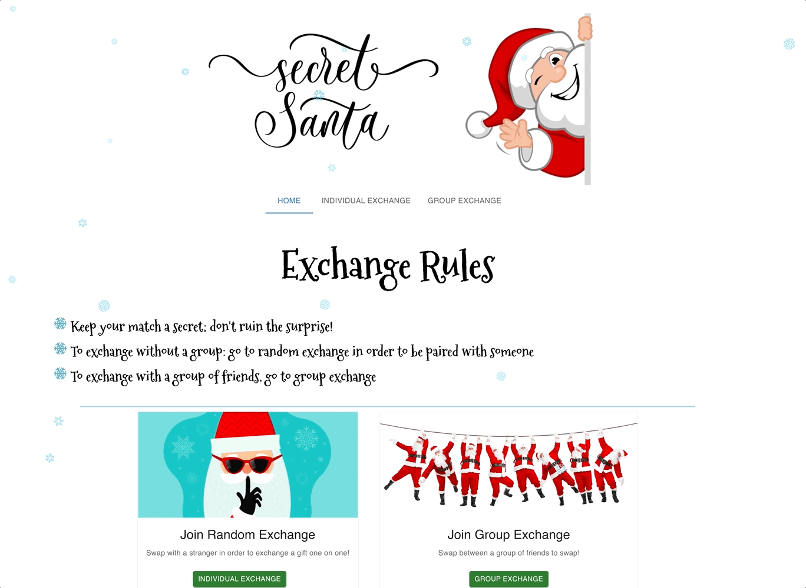
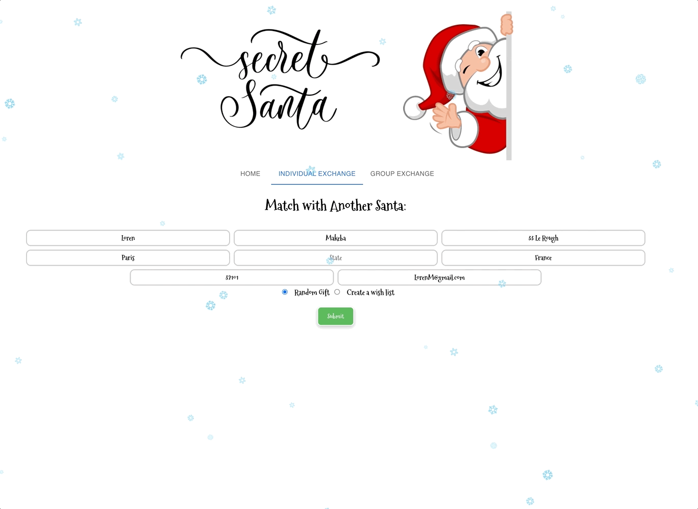
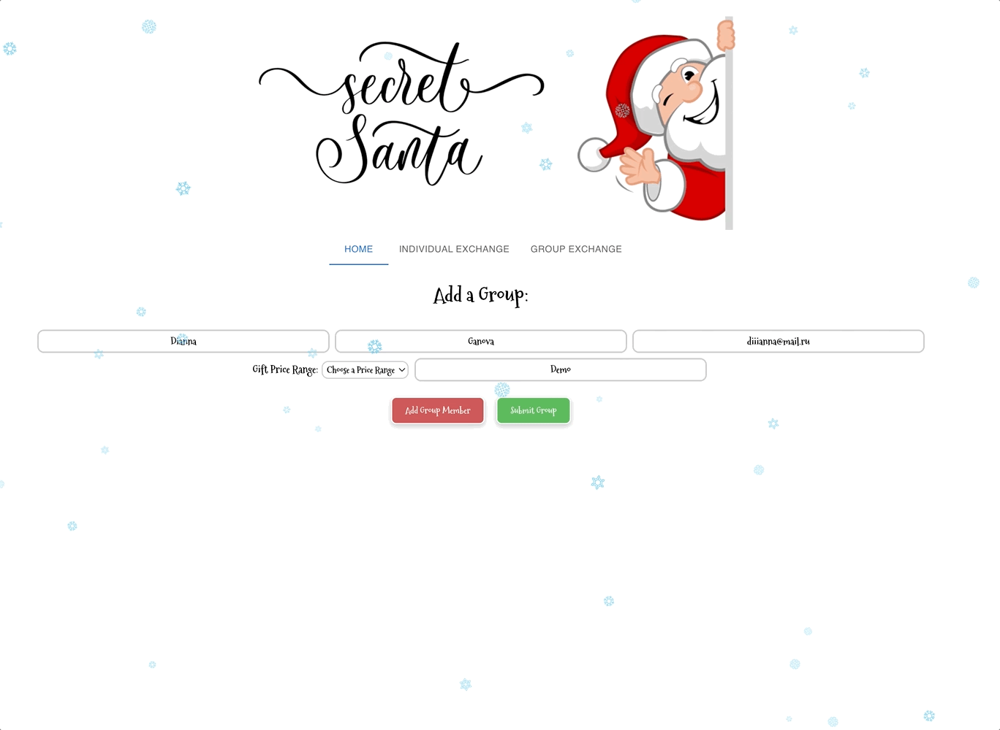

## Secret Santa
It's an opportunity to find a random person from the same price category to exchange gifts or create your group of friends to generate random pairs.

There are two different logic for generating pairs: 
 - for individual gift exchange when you submit the form you will get an information about your pair and this person will have you as his pair;
 

 - for group exchange at first you need to add all group members and then when you submit the group you will get a list of pairs where the giver can't be the reciver in the same pair.
 

User will be removed from the db.json file only after the pair is generated.
## Technologies Used
 - React, 
 - HTML, 
 - CSS, 
 - JSON server for storing users info 

## Authors
_**Olha Gruzglina**_ and _**Alison Melendez**_

## Contact Information

- [Olha's Github](https://github.com/ogruzglina "Olha Gruzglina")
- [Olha's Linkedin](https://www.linkedin.com/in/olha-gruzglina-a4403b53/ "Olha Gruzglina")
- [Alison's Github](https://github.com/alisonmelendez "Alison Melendez") 
- [Alison's Linkedin](https://www.linkedin.com/in/alison-melendez/ "Alison Melendez")